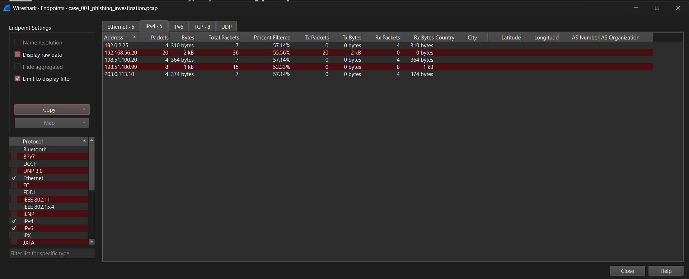
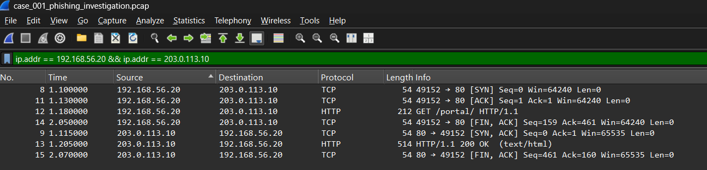
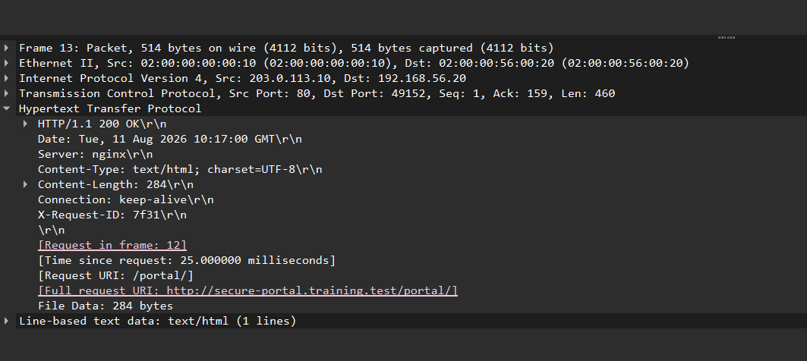
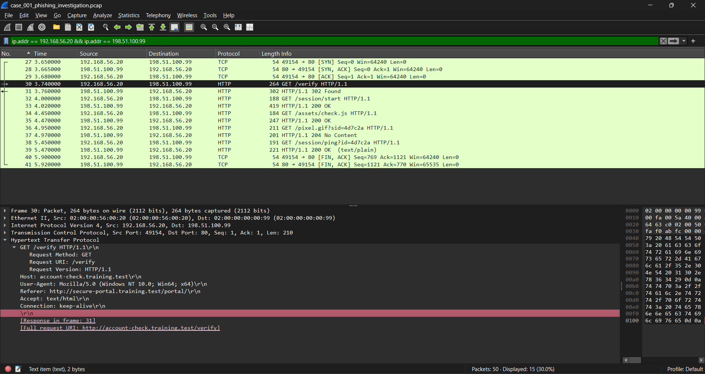
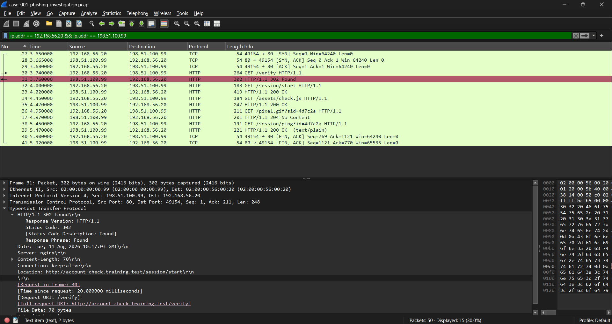
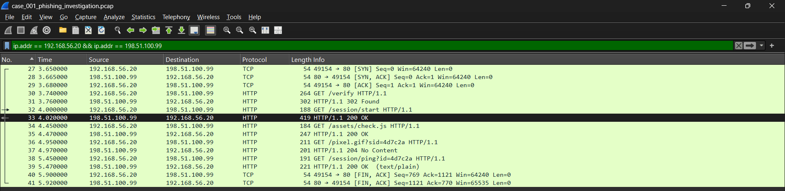

# PCAP Network Investigation — Wireshark

## Project Overview

This repository documents a network traffic investigation performed using **Wireshark** and a simulated PCAP dataset.

The objective was to determine whether a user's interaction with a web portal resulted in communication with a potentially suspicious external destination.

The investigation focused on reconstructing the relevant network conversations, analyzing TCP and HTTP traffic, identifying the communicating hosts, correlating application-layer artifacts, and determining whether the available evidence was sufficient to classify the activity as malicious.

This project simulates a **Tier 1 SOC Analyst** investigating potentially suspicious web activity.

---

## Scenario

An employee named **Sarah** accessed a web portal, after which her workstation communicated with several external destinations.

The investigation sought to answer:

> **Did Sarah's interaction with the portal lead to suspicious external communication, and should the activity be investigated further?**

---

## Investigation Workflow

1. Identify Sarah's workstation.
2. Isolate relevant network traffic.
3. Identify external destinations.
4. Reconstruct TCP conversations.
5. Analyze HTTP requests and responses.
6. Identify domains and application behavior.
7. Correlate the observed activity and assess whether it is suspicious.
8. Determine what additional evidence would be required for a higher-confidence verdict.

---

## Tool Used

| Tool      | Purpose                                                                                |
| --------- | -------------------------------------------------------------------------------------- |
| Wireshark | PCAP analysis, traffic filtering, TCP conversation reconstruction, and HTTP inspection |

---

# Step 1: Identify the Workstation

The case identified Sarah's workstation as:

```text
192.168.56.20
```

Filtering traffic originating from this address revealed several destinations:

```text
192.0.2.25
198.51.100.20
198.51.100.99
203.0.113.10
```

### Screenshot



### Analyst Observation

Multiple conversations originated from Sarah's workstation. The investigation focused on reconstructing these conversations rather than treating every external IP as suspicious by default.

---

# Step 2: Analyze the Initial Connection

One of the first external connections identified was:

```text
192.168.56.20:49152
        ↓
203.0.113.10:80
```

The connection began with the standard TCP three-way handshake:

```text
SYN → SYN/ACK → ACK
```

### Screenshot



### Analyst Assessment

The TCP handshake was normal. The investigation therefore moved to the application layer to determine what the connection was actually being used for.

---

# Step 3: Inspect the Portal Response

The workstation requested:

```text
GET /portal/ HTTP/1.1
```

The server responded:

```text
HTTP/1.1 200 OK
```

The HTTP response contained the following relevant fields:

```text
Server: nginx
Content-Type: text/html; charset=UTF-8
Content-Length: 284
Connection: keep-alive
X-Request-ID: 7f31
```

The response was associated with the request in Frame 12 and was received approximately 25 milliseconds after the request.

The full request URI was:

```text
http://secure-portal.training.test/portal/
```

The response contained 284 bytes of HTML file data.

### Screenshot



### Analyst Observation

The workstation successfully retrieved the `/portal/` resource and received a valid HTTP `200 OK` response containing HTML content.

The response identified **nginx** as the web server and included an application-level `X-Request-ID` value (`7f31`), which could potentially support correlation with application-side logs if such evidence were available.

Inspection of the HTML response body revealed a `Continue` link pointing to:

```text
http://account-check.training.test/verify
```

The relevant HTML was:

```html
<a href="http://account-check.training.test/verify">Continue</a>
```

### Analyst Assessment

The portal contained a direct reference to an external verification service.

However, at this stage, the presence of a link only established that the portal **could direct the user toward** the external service. It did not yet establish that the workstation actually followed the link or what occurred afterward.

The investigation therefore continued by examining subsequent network traffic.

---

# Step 4: Identify the Verification Request

A subsequent TCP connection was established between:

```text
192.168.56.20:49154
        ↓
198.51.100.99:80
```

The first HTTP request was:

```text
GET /verify HTTP/1.1
```

The `Host` header identified the destination as:

```text
account-check.training.test
```

The request also contained:

```text
Referer:
http://secure-portal.training.test/portal/
```

### Screenshot



### Analyst Observation

The workstation subsequently requested the exact `/verify` resource that had been identified within the portal's HTML.

The `Referer` header also pointed back to:

```text
http://secure-portal.training.test/portal/
```

This provided an additional correlation between the portal page and the external verification request.

### Analyst Assessment

The evidence now established more than simply the existence of two communicating hosts.

The PCAP showed:

```text
Portal HTML
     ↓
/verify link
     ↓
Workstation requests /verify
```

This supported the conclusion that the external request was part of the portal's observed application flow.

The investigation then examined the response to determine what happened after the verification request.

---

# Step 5: Analyze the Redirect

The `/verify` request received:

```text
HTTP/1.1 302 Found
```

with:

```text
Location:
http://account-check.training.test/session/start
```

### Screenshot



### Analyst Observation

The external server responded to `/verify` with an HTTP `302 Found` response and directed the client to:

```text
/session/start
```

### Analyst Assessment

The redirect confirmed that the external server directed the client from `/verify` to `/session/start`.

A `302` response is normal HTTP behavior and is not inherently malicious. Its significance depends on the broader sequence of activity.

The investigation therefore continued by examining the subsequent session activity.

---

# Step 6: Analyze Session Activity

The workstation followed the redirect:

```text
GET /session/start HTTP/1.1
```

The server responded with:

```text
HTTP/1.1 200 OK
Set-Cookie: sid=4d7c2a
```

The same session identifier was subsequently observed in requests including:

```text
GET /pixel.gif?sid=4d7c2a
GET /session/ping?id=4d7c2a
```

Additional activity included:

```text
GET /assets/check.js
```

### Screenshot



### Analyst Observation

The traffic could be reconstructed as:

```text
/verify
   ↓
302 Redirect
   ↓
/session/start
   ↓
Session Cookie
   ↓
/assets/check.js
   ↓
/pixel.gif?sid=4d7c2a
   ↓
/session/ping?id=4d7c2a
```

The repeated session identifier provided evidence that these requests were related to the same application/session activity.

### Analyst Assessment

The PCAP demonstrated that the workstation did not simply contact the external host once.

The `/verify` request resulted in a redirect, followed by session establishment and subsequent session-associated requests.

This established a coherent application-layer sequence that could be reconstructed from the captured traffic.

However, the observed session behavior alone did not establish whether the activity was legitimate or malicious.

---

# Step 7: Correlate the Portal and External Activity

At this stage, the individual pieces of evidence were correlated to reconstruct the observed application flow.

The evidence showed:

```text
1. Workstation accessed the portal
          ↓
2. Portal returned HTML
          ↓
3. HTML contained a link to
   account-check.training.test/verify
          ↓
4. Workstation requested /verify
          ↓
5. External server returned 302
          ↓
6. Client followed /session/start
          ↓
7. Session was established
          ↓
8. Subsequent session-associated requests occurred
```

### Screenshot


### Analyst Observation

The external communication was directly associated with the portal's application flow.

The relationship was supported by multiple independent artifacts:

* The portal HTML contained the `/verify` link.
* The workstation subsequently requested `/verify`.
* The `Referer` header pointed back to `/portal/`.
* The external server redirected the client to `/session/start`.
* A session identifier was established and subsequently reused.

### Analyst Assessment

The evidence supports the conclusion that the communication with `account-check.training.test` was not merely an unrelated external connection occurring after the portal visit.

Instead, the PCAP demonstrates a connected application flow between the portal and the external verification service.

However, the available network evidence does **not independently establish malicious intent**.

The destination could represent legitimate third-party functionality, suspicious infrastructure, or malicious infrastructure. Additional evidence would be required to make that determination with higher confidence.

---

# Key Findings

| Finding                                      | Result    |
| -------------------------------------------- | --------- |
| Sarah's workstation identified               | Confirmed |
| External communication observed              | Confirmed |
| TCP connections established                  | Confirmed |
| HTTP traffic observed                        | Confirmed |
| `account-check.training.test` identified     | Confirmed |
| Portal HTML referenced `/verify`             | Confirmed |
| Workstation subsequently requested `/verify` | Confirmed |
| `Referer` linked `/verify` to `/portal/`     | Confirmed |
| HTTP redirect observed                       | Confirmed |
| Session established                          | Confirmed |
| Session identifier reused                    | Confirmed |
| Portal-to-external application relationship  | Confirmed |
| Malicious activity conclusively established  | No        |

---

# Final Analyst Verdict

### **Suspicious — Further Investigation Recommended**

The PCAP demonstrates a connected application flow between Sarah's workstation, the internal portal, and `account-check.training.test`.

The portal returned HTML containing a direct link to the external `/verify` endpoint. The workstation subsequently accessed that endpoint, received a redirect to `/session/start`, established a session, and generated additional session-associated requests.

This behavior warrants further investigation because the PCAP establishes a meaningful relationship between the portal and the external service.

However, **the PCAP alone does not establish that the external destination is malicious.**

### Current Confidence

**Inconclusive from PCAP alone**

This distinction is important:

> **Unknown does not mean benign, and suspicious does not automatically mean malicious.**

The available evidence supports escalation for additional analysis rather than a definitive malicious classification.

---

# Further Investigation Opportunities

If the investigation were continued, the identified indicators could be enriched using:

* Domain and IP reputation services
* DNS and passive DNS history
* WHOIS/registration information
* Proxy and firewall logs
* Endpoint/EDR telemetry
* Browser history
* Downloaded files and file hashes
* Application/server-side logs using the observed `X-Request-ID`

These additional data sources could help determine whether the observed behavior represents legitimate application functionality, suspicious activity, or confirmed malicious activity.

---

# Skills Demonstrated

* Wireshark
* PCAP Analysis
* Network Traffic Analysis
* TCP/IP Analysis
* HTTP Investigation
* TCP Three-Way Handshake Analysis
* HTTP Request/Response Analysis
* HTTP Payload Inspection
* Domain Identification
* Host Header Analysis
* Referer Header Analysis
* HTTP Redirect Analysis
* Session Tracking
* Application Flow Reconstruction
* Network Timeline Reconstruction
* SOC Triage
* Threat Investigation
* Evidence-Based Analysis
* Incident Documentation

---

# Key Lessons Learned

* A PCAP should be analyzed as a **conversation**, not simply as individual packets.
* Initial observations should be refined as deeper packet and payload inspection reveals additional evidence.
* IP addresses provide a starting point but do not independently establish maliciousness.
* HTTP headers such as `Host`, `Referer`, `Location`, and `Set-Cookie` can provide valuable investigative context.
* HTTP response bodies can contain important application-level evidence that is not visible in packet summaries.
* A redirect is not inherently malicious; its significance depends on the surrounding behavior.
* Correlating multiple artifacts can establish an application flow more reliably than relying on a single packet or indicator.
* Unknown indicators should remain **unknown** until sufficient evidence exists to classify them.
* Strong security conclusions come from **correlating multiple sources of evidence** rather than relying on a single artifact.

---

## Author

**Blessing O.**

Aspiring SOC Analyst focused on Security Operations, Threat Intelligence, Network Security, and Incident Response.

* LinkedIn: https://www.linkedin.com/in/ogburogho-blessing-22376b23a
* GitHub: https://github.com/Kess1Gflex
